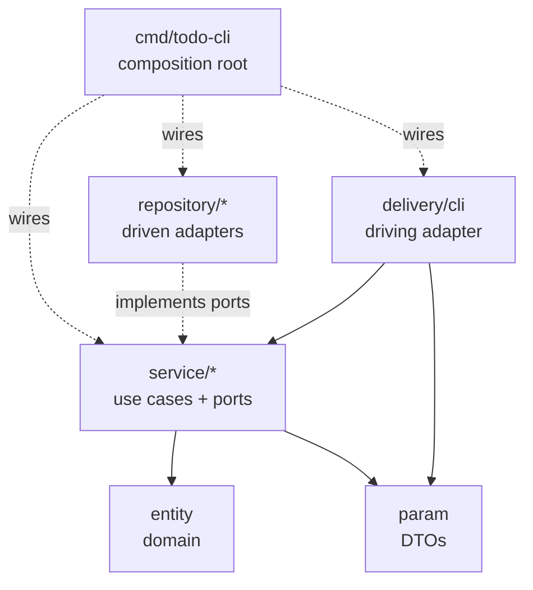

# TODO App — Clean Architecture in Go


-blue)


A small command-line TODO manager — users, categories and tasks — built as a study of
**clean / layered architecture** in Go. The domain logic is completely decoupled from
its delivery mechanism and its storage, so the same business rules can be driven by a CLI
today and an HTTP server tomorrow **without touching a single line of the service layer**.

---

## Table of Contents

- [Why this project](#why-this-project)
- [Architecture at a glance](#architecture-at-a-glance)
- [Project structure](#project-structure)
- [Practices & patterns showcased](#practices--patterns-showcased)
- [Getting started](#getting-started)
- [Usage](#usage)
- [Data persistence](#data-persistence)
- [Roadmap](#roadmap)

---

## Why this project

It's easy to write a TODO app in one `main.go`. The point here is the opposite: to show
how to keep a codebase **honest about its dependencies** as it grows. Every design choice
below answers one question — *"when the requirements change, what has to change with them?"*

- Swap file storage for PostgreSQL? Only `repository/` changes.
- Add an HTTP API next to the CLI? Only `delivery/` and `cmd/` change.
- Change how a task is validated? Only `service/` changes.

The layers make those blast radiuses small and predictable.

---

## Architecture at a glance

The whole design obeys one rule — **the Dependency Rule**: source-code dependencies point
**inward**, toward the domain. Outer layers (delivery, storage) know about the inner ones;
the inner ones never import the outer.



| Layer | Package(s) | Responsibility | Depends on |
| --- | --- | --- | --- |
| **Domain** | `entity` | Pure business types. No json, no db, no framework. | nothing |
| **DTOs** | `param` | Request/response shapes crossing the service boundary. | `entity` |
| **Application** | `service/user`, `service/task`, `service/category` | Business rules + the **ports** (interfaces) each use case needs. | `entity`, `param` |
| **Driven adapters** | `repository/filestore`, `repository/memory` | Concrete storage implementing the service ports. | `entity` |
| **Driving adapter** | `delivery/cli` | Translates the outside world (terminal) into use-case calls. | `service`, `param` |
| **Composition root** | `cmd/todo-cli` | Builds and wires every concrete dependency. | everything |
| **Shared kit** | `pkg/password`, `config` | Generic, domain-agnostic helpers. | — |

> **Mental map for FastAPI/Django folks:** `entity` = domain model · `param` = Pydantic
> schema · `service` = use case · interfaces = **ports** · `repository` = driven adapter ·
> `delivery` = router/controller (driving adapter) · `cmd/main` = DI container / app factory.

---

## Project structure

```
todoapp/
├── cmd/
│   └── todo-cli/
│       └── main.go              # composition root: build + wire + run
├── entity/                      # pure domain types
│   ├── user.go
│   ├── task.go
│   └── category.go
├── param/                       # request/response DTOs (json-tagged, HTTP-ready)
│   ├── user.go
│   ├── task.go
│   └── category.go
├── service/                     # business logic + ports
│   ├── user/service.go          #   Register / Login
│   ├── task/service.go          #   Create / List
│   └── category/service.go      #   Create
├── repository/                  # storage adapters
│   ├── filestore/user.go        #   users → JSON-lines file
│   └── memory/                  #   tasks & categories → in-RAM (mutex-guarded)
│       ├── task.go
│       └── category.go
├── pkg/
│   └── password/bcrypt.go       # bcrypt hash/compare, isolated
├── config/config.go             # centralized settings
├── go.mod
└── go.sum
```

---

## Practices & patterns showcased

### 1. Ports are defined by the consumer

Each service declares the interface **it** needs, right next to where it's used — not in a
shared `contracts` package the whole app leaks into. Storage must satisfy the service, not
the other way around. This is interface segregation + dependency inversion in one move.

```go
// service/task/service.go
type Repository interface {
    Create(t entity.Task) (entity.Task, error)
    GetByUserID(userID uint) ([]entity.Task, error)
}
```

### 2. "Accept interfaces, return structs"

Constructors take the narrow port they depend on and return a concrete `Service`. Callers
stay flexible; the service stays testable with a fake repository.

```go
// service/task/service.go
func New(repo Repository, categories CategoryValidator) Service { ... }
```

### 3. Dependency injection via a single composition root

`cmd/todo-cli/main.go` is the **only** place that knows every concrete type at once. Nothing
else reaches out for its dependencies — they're handed in. No globals, no service locators.

```go
// cmd/todo-cli/main.go
userStore, _ := filestore.NewUserStore(cfg.UserFilePath)
taskStore     := memory.NewTaskStore()
categoryStore := memory.NewCategoryStore()

userSvc     := user.New(userStore, cfg.BcryptCost)
categorySvc := category.New(categoryStore)
taskSvc     := task.New(taskStore, categoryStore) // categoryStore injected as a validator
```

### 4. One adapter, several ports

`memory.CategoryStore` implements both `category.Repository` (to create categories) **and**
`task.CategoryValidator` (so the task service can confirm ownership) — without either
service knowing about the other. Composition over coupling.

```go
// task service depends only on this narrow port:
type CategoryValidator interface {
    IsOwnedByUser(categoryID, userID uint) (bool, error)
}
```

### 5. DTOs kept separate from domain entities

`entity` types carry **no** transport tags — they never learn about json. The `param` types
own the wire format, which is exactly what the future HTTP handlers will decode into.

```go
// param/task.go — UserID comes from the session, never from client input:
type CreateTaskRequest struct {
    Title      string `json:"title"`
    DueDate    string `json:"due_date"`
    CategoryID uint   `json:"category_id"`
    UserID     uint   `json:"-"`   // server-controlled, excluded from json
}
```

### 6. Concurrency-safe storage, ready for HTTP

Every in-memory store guards its state with a `sync.Mutex`. The CLI is single-threaded, but
the HTTP server (next milestone) serves each request in its own goroutine — the repositories
are already correct under that model.

### 7. Security defaults baked in

- Passwords are **bcrypt-hashed** through an isolated `pkg/password`; the plain text never
  hits storage.
- Login returns a **generic** "email or password is incorrect" for both unknown-email and
  wrong-password, so it doesn't leak which accounts exist.
- The safe `param.UserInfo` view omits the password hash entirely.

### 8. Errors are wrapped, not swallowed

Lower layers return and wrap (`fmt.Errorf("...: %w", err)`) so context accumulates; only the
delivery layer decides how to present the failure. No `println`-and-continue.

### 9. Centralized configuration

Ports, file paths and the bcrypt cost live in `config`, loaded once — not hardcoded across
the codebase.

---

## Getting started

**Prerequisites:** Go 1.25+

```bash
# clone, then from the project root:
go mod download
go run ./cmd/todo-cli
```

Build a binary instead:

```bash
go build -o todo-cli ./cmd/todo-cli
./todo-cli
```

Handy during development:

```bash
go vet ./...     # static checks — passes clean
go build ./...   # compile everything
```

---

## Usage

The app is an interactive prompt. Available commands:

```
register | login | create-category | create-task | list-task | exit
```

Everything except `register` / `login` requires an authenticated session (you'll be asked to
log in on demand). A typical run:

```text
***** Welcome to TODO app *****
commands: register | login | create-category | create-task | list-task | exit

Please enter a command: register
Name: esi
Email: esi@example.com
Password: ****
user registered successfully: #1 esi@example.com

Please enter a command: login
Email: esi@example.com
Password: ****
logged in as esi@example.com

Please enter a command: create-category
Category title: Work
Category color: red
category created: #1 Work (red)

Please enter a command: create-task
Task title: Write the README
Category ID: 1
Due date: tomorrow
task created: #1 Write the README

Please enter a command: list-task
your tasks:
  #1 [todo] Write the README (due: tomorrow)
```

---

## Data persistence

- **Users** are persisted to `user.txt` as one JSON object per line. The store loads the
  file once on startup, tracks the highest ID, and appends on every create — so IDs stay
  unique across restarts.
- **Tasks & categories** live in memory and reset when the process exits. They sit behind the
  same repository ports as the file store, so promoting them to a persistent adapter later is
  a drop-in change.

---

## Roadmap

The architecture is deliberately shaped so the next steps are additive, not invasive:

- [ ] **HTTP delivery** — add `delivery/httpserver` and `cmd/todo-server`, reusing the exact
      same services and `param` types. The service layer stays untouched.
- [ ] **Persistent tasks/categories** — a `repository/postgres` (or a fuller file store)
      implementing the existing ports.
- [ ] **Auth tokens** — issue and verify a session/JWT so the HTTP layer can populate
      `UserID` the same way the CLI populates it from its session.
- [ ] **Tests** — unit-test each service against fake repositories (the ports make this trivial).

---

*A learning project focused on architecture over feature count. Contributions and critique welcome.*
